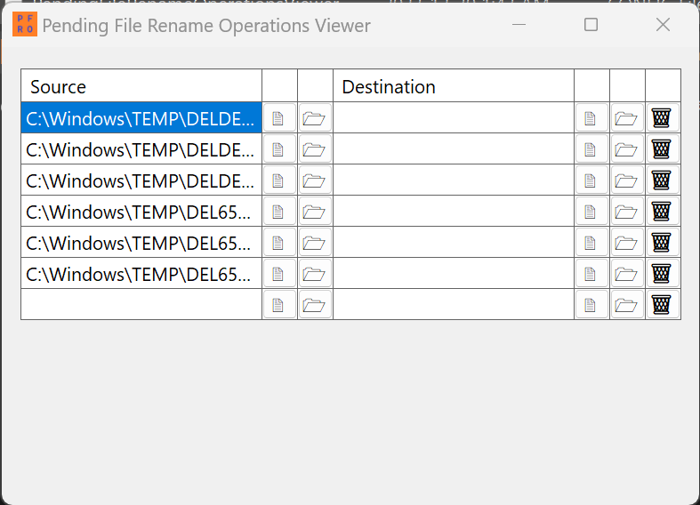

# Pending File Rename Operations Viewer

Pending File Rename Operations Viewer is a simple tool that allows you to view pending file renames and deletions from the `PendingFileRenameOperations` registry key.

## Screenshot

# Building

Pending File Rename Operations Viewer is built with Visual Studio. 
To create a production version of the application, publish the project "PendingFileRenameOperationsViewer".